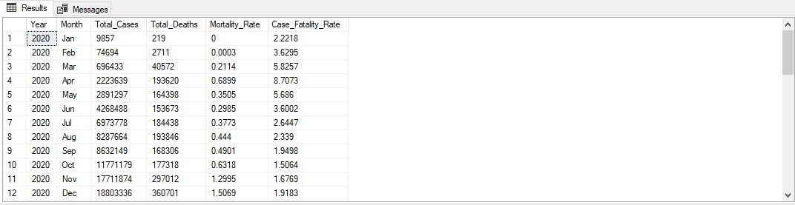
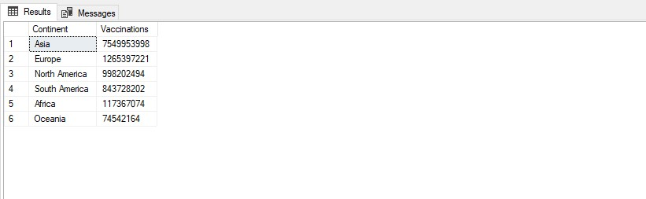

# Data Exploration using SQL

## Introduction
In this project, I used a Covid-19 dataset and explored it using SQL to analyze and gain insights into the data. This was achieved 
with Microsoft SQL Server Management Studio. The data used ranges from January 03, 2020, to July 19, 2023.

## Objective
1. To find the percentage of people who died from Covid-19.
2. To find the percentage of people who died from Covid-19 across different countries.
3. To determine the percentage of people who contracted Covid-19 across different countries.
4. To show countries with the highest number of deaths.
5. To find the total cases and death count recorded across continents.
6. To show how the death count has trended over time.
7. To show Mortality and Case Fatality Rates trend by Year and Month.
8. To show the dates of the first recorded cases and the number of cases recorded.
9. To determine how many people have been vaccinated out of the total population.
10. To find the number of people vaccinated across different continents out of the total population.
11. To show many cases and deaths Nigeria has had so far? Show the Mortality, Case fatality rate, and vaccinations administered.

## Data Sourcing
The dataset used for this project was downloaded from a popular website known as _Our World in Data_. To access this dataset, follow this 
[link](https://ourworldindata.org/covid-deaths). The current dataset may differ from that which was used for the project as it is 
updated daily.

## Procedures
After downloading the data (in CSV format), I formatted the data in Microsoft Excel and seperated the dataset into two different Excel
workbooks (Covid_Deaths and Covid_Vaccinations). This was done in order to reduce the size and also use it later on to demonstrate the 
use of SQL JOINS. Thereafter, the two files were imported into MSSQL Server.

## Skills Demonstrated
The project enabled me to showcase my skills in 
- Basic SELECT statements
- SQL Joins
- The use of CTEs (Common Table Expressions)
- Creating temporary tables
- Inserting data into a table
- Aggregate and date functions
- Case statement
  
## Results
All the SQL queries discussed below can be found [here](Data_Exploration.sql)
    
### _To find the percentage of people who died from Covid-19_

```
SELECT 
	SUM(new_cases) AS Total_Cases,  
	SUM(new_deaths) AS Total_Deaths,
	ROUND(SUM(new_deaths)/SUM(new_cases) * 100,2) AS Overall_Case_Fatality_Rate 
FROM Portfolio_Project.[dbo].Covid_Deaths  
WHERE continent IS NOT NULL
```


The above table shows the total number of Covid cases (**_Seven Hundred and Seventy Million_**), the total number of people who died as a result of Covid (**_Seventy Million_**), and a fatality rate of approximately one percent (**_0.92%_**).
***

### _To find the percentage of people who died from Covid-19 across different countries_

```
SELECT 
	location AS Country,
	COALESCE(SUM(new_cases),0) AS Total_Cases, 
	COALESCE(SUM(new_deaths),0) AS Total_Deaths,
	ROUND(COALESCE(SUM(new_deaths)/ NULLIF(SUM(new_cases),0),0) * 100,2) AS Case_Fatality_Rate
FROM Portfolio_Project.[dbo].Covid_Deaths
WHERE continent IS NOT NULL 
GROUP BY location
ORDER BY Case_Fatality_Rate DESC
```


Here, the Covid cases and total deaths along with case fatality rate (the percentage of people who died from the virus) were shown for each country. Yemen has the highest case fatality rate, followed by Sudan, and Syria repectively. 
***

### _To determine the percentage of people who contracted Covid-19 across different countries_

```
SELECT 
	location AS Country, 
	population, 
	COALESCE(SUM(new_cases),0) AS Total_Cases, 
	ROUND(COALESCE(SUM((new_cases/population)),0) * 100,2) AS PercentPopulationInfected
FROM Portfolio_Project.[dbo].Covid_Deaths
WHERE continent IS NOT NULL
GROUP BY location, population
ORDER BY PercentPopulationInfected DESC 
```


The above table depicts the percentage of a population that has been infected by Covid. In Cyprus, more than Seventy percent of the population is infected (**_73.76%_**), and is closely followed by San Marino where **_72.27%-** of the population is infected while other countries had less than seventy percent.

### _Total Deaths vs. Population_

```
SELECT 
	location AS Country, 
	population,
	COALESCE(SUM(new_deaths),0) AS Total_Deaths, 
	ROUND(COALESCE(SUM((new_deaths/population)),0) * 100,2) AS Mortality_Rate
FROM Portfolio_Project.[dbo].Covid_Deaths
WHERE continent IS NOT NULL
GROUP BY location, population
ORDER BY Mortality_Rate DESC
```


In terms of Mortality rate (the percentage of the population that died), Peru is ahead (**_0.65%_**), followed by Bulgaria (**_0.57%_**), and Bosnia and Herzegovina (**_0.51%_**).
***

### _To show countries with the highest number of deaths_
 ```
SELECT TOP (10) 
	location AS Country, 
	SUM(new_deaths) AS Total_Deaths
FROM Portfolio_Project.[dbo].Covid_Deaths
WHERE continent IS NOT NULL  
GROUP BY location
ORDER BY Total_Deaths DESC
```


The above table shows the top 10 ranked countries with the high deaths resulting from Covid. All Continents were represented except for Africa and Oceania. Majority of the people who died are from the United States (**_1,129,589_**)
***

### _To find the total cases and death count recorded across continents_

```
SELECT 
	location AS Continent, 
	SUM(new_cases) AS Total_Cases,
	SUM(new_deaths) AS Total_Deaths
FROM Portfolio_Project.[dbo].Covid_Deaths
WHERE continent IS NULL 
	AND location IN ('Europe','Africa','South America','North America','Asia','Oceania')
GROUP BY location
ORDER BY Total_Cases DESC
```


Asia has recorded the highest covid case so far with over **_three hundred million_** cases. African on the other hand has recorded the lowest number of cases with low death as well. Although, more people have died in Europe compared to any of the other continents.
***

 ### _To show how the death count has trended over time_

```
SELECT
	YEAR(date) AS Year, 
	SUM(new_deaths) AS Total_Deaths
FROM Portfolio_Project.[dbo].Covid_Deaths
WHERE continent IS NOT NULL 
GROUP BY YEAR(date) 
ORDER BY Total_Deaths DESC
```


From the above table, we can see that more people died as a result of covid in 2021 than any other year since 2020. 
***

### _To show Mortality and Case Fatality Rates trend by Year and Month_

```
SELECT 
	YEAR(date) AS Year,
		CASE 
		WHEN  MONTH(date) = 1 THEN 'Jan' WHEN  MONTH(date) = 2 THEN 'Feb' 
		WHEN  MONTH(date) = 3 THEN 'Mar' WHEN  MONTH(date) = 4 THEN 'Apr'  
		WHEN  MONTH(date) = 5 THEN 'May' WHEN  MONTH(date) = 6 THEN 'Jun'
		WHEN  MONTH(date) = 7 THEN 'Jul' WHEN  MONTH(date) = 8 THEN 'Aug' 
		WHEN  MONTH(date) = 9 THEN 'Sep' WHEN  MONTH(date) = 10 THEN 'Oct'  
		WHEN  MONTH(date) = 11 THEN 'Nov'WHEN  MONTH(date) = 12 THEN 'Dec'
		END AS Month,
	SUM(new_cases) AS Total_Cases,
	SUM(new_deaths) AS Total_Deaths,
	ROUND(COALESCE(SUM((new_deaths/population)),0) * 100,4) AS Mortality_Rate,
	ROUND(COALESCE(SUM(new_deaths)/ NULLIF(SUM(new_cases),0),0) * 100,4) AS Case_Fatality_Rate
FROM Portfolio_Project.[dbo].Covid_Deaths
WHERE continent IS NOT NULL 
GROUP BY YEAR(date), MONTH(date)
ORDER BY Year, MONTH(date)
```



I had mortality rate and case fatality rate sliced by year and month to show monthly cases and deaths. The mortality and case fatality rates were rounded to 4 decimal places so as to allow for readability as the original value is longer.
***

### _To show the dates of the first recorded cases and the number of cases recorded_

```
SELECT 
	location,
	MIN(date) AS Date,
	MIN(new_cases) AS Number_Cases_Recorded
FROM Portfolio_Project.[dbo].Covid_Deaths
WHERE continent IS NOT NULL 
	AND new_cases IS NOT NULL 
	AND new_cases != 0
GROUP BY location 
ORDER BY location
```


The above table shows the date each country record their first covid cases as well as the number of cases recorded. We can see that Afghanistan recorded their first covid case on February 26, 2020 with just one case. Meanwhile Argentina recorded their first two cases on March 05, 2020.
***

### _To determine how many people have been vaccinated out of the total population_
```
SELECT 
	cd.continent AS Continent,
	cd.location AS Country, 
	cd.date AS Date, 
	cd.population AS Population, 
	COALESCE(cv.new_vaccinations,0) AS Daily_Vaccinations,
	COALESCE(SUM(cv.new_vaccinations) 
			OVER(PARTITION BY cd.location ORDER BY cd.location, cd.date),0) AS Rolling_Count_Vaccinated
FROM Portfolio_Project..Covid_Deaths AS cd
	JOIN Portfolio_Project.[dbo].Covid_Vaccinations AS cv
		ON cd.location = cv.location
		AND cd.date = cv.date
WHERE cd.continent IS NOT NULL 
ORDER BY 2,3
```


Here, I created a column for rolling count which sums the cases recorded sequentially for each country on a daily basis.
***

### _To find the number of people vaccinated across different continents out of the total population_

```
SELECT 
	cd.continent AS Continent,
	SUM(cv.new_vaccinations) AS Vaccinations
FROM Portfolio_Project..Covid_Deaths AS cd
	 JOIN Portfolio_Project..Covid_Vaccinations AS cv
		ON cd.location = cv.location
		AND cd.date = cv.date
WHERE cd.continent IS NOT NULL 
GROUP BY cd.continent
ORDER BY Vaccinations DESC
```



Majority of the people vaccinated are from Asia, followed by people from Europe, and North America Respectively
***

### _To show many cases and deaths Nigeria has had so far? Show the Mortality, Case fatality rate, and vaccinations administered_

```
SELECT 
	YEAR(cd.date) AS Year,
	SUM(cd.new_cases) AS Total_Cases,
	SUM(new_deaths) AS Total_Deaths,
	ROUND((SUM(new_deaths)/SUM(cd.new_cases))*100,4) AS Case_Fatality_Rate,
	COALESCE(SUM(cv.new_vaccinations),0) AS Vaccinations
FROM Portfolio_Project..Covid_Deaths AS cd
	 JOIN Portfolio_Project..Covid_Vaccinations AS cv
		ON cd.location = cv.location
		AND cd.date = cv.date
WHERE cd.continent IS NOT NULL
	AND cd.location = 'Nigeria'
GROUP BY YEAR(cd.date), cd.population
```


In Nigeria, majority of Covid cases were recorded in 2021 and more people died in this period as a result. Covid cases have reduced since 2020. As at the time of this project no death is recorded in Nigeria and no one has been vaccinated yet.

## Conclusion
This project showcases the use of SQL to explore and gain insights into any data. Although the project didn't cover every aspect of the dataset, it was able to show some unique results and insights and trends on Covid-19 cases, deaths, and Vaccination around the world.  
